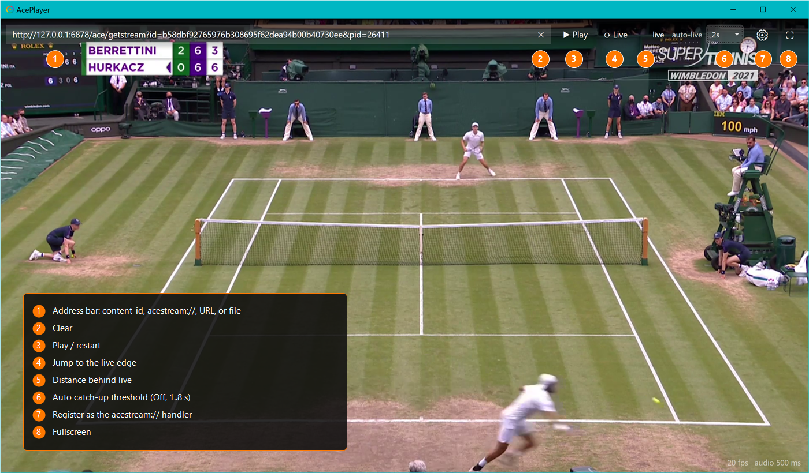

# AcePlayer

A lightweight Windows player for **Ace Stream** live broadcasts that keeps you at the live edge and
recovers from network hiccups instead of quietly falling behind.

## Why this exists

I watch live sports over Ace Stream. My HTPC sits on Wi-Fi, and with the usual players (VLC, the
official Ace Stream player) I kept hitting the same annoyance: playback would briefly stall, then
resume, but every stall pushed me further behind the actual broadcast and the lag only ever
accumulated. After a while I would be tens of seconds behind real time, and the only fix was to
stop and restart the stream.

For a lot of people that is perfectly acceptable. Being a few seconds, or even a minute, behind
live simply does not matter to them. For me, watching a match, it did. So I wrote this.

AcePlayer has one design goal:

> **Always show the freshest frames, smoothly, and never silently drift behind live.**

When it genuinely falls behind (a real network stall), it catches back up to the live edge on its
own, on a threshold you choose, rather than quietly accumulating latency forever.

## What it does

- Decodes the Ace Stream MPEG-TS feed directly via FFmpeg, so it has full control over buffering
  and the live edge, which off-the-shelf players do not hand you.
- Deinterlacing (bwdif) for broadcast 1080i / 576i content.
- Smooth, low-latency playout: a small cushion absorbs jitter and presentation is clock-driven, so
  it neither stutters nor accumulates delay in normal operation.
- Automatic jump-to-live on a configurable lag threshold (Off, or 1 to 8 seconds). Below the
  threshold it leaves playback alone, with no constant re-syncing; once accumulated stall time
  crosses it, playback snaps back to live in a single move.
- Closes the betting-ad window the ad-supported Ace engine opens in your default browser when a
  stream starts, whichever browser that is (Chrome, Edge, Firefox, ...).
- VLC-style volume control (0 to 200 percent) with a mute toggle.
- Keeps the display awake while playing, so the screensaver or sleep never interrupts a match.
- Fullscreen (double-click or F11), a single click toggles the controls, and they auto-hide with
  the cursor. The Play button turns into Stop while a stream is playing.
- Portable single `.exe` (about 5 MB) with a trimmed FFmpeg build embedded, so there is nothing to
  install and no DLLs to ship alongside it.
- Registers as the `acestream://` protocol handler and for `.acelive` / `.acestream` files (current
  user only, no administrator rights).
- Remembers the last source, the live threshold and the volume between runs.

## Requirements

AcePlayer is a front-end for the Ace Stream engine, it does not download the P2P streams itself.
You must install **Ace Stream Media** first and have it running, otherwise there is nothing for the
player to connect to. Get it from the official
[Ace Stream products page](https://docs.acestream.net/products/).

- Windows 10 / 11 (x64)
- [Ace Stream Media](https://docs.acestream.net/products/) installed and running (the engine
  listens on `127.0.0.1:6878`)
- .NET Framework 4.8

## Usage

Paste any of these into the address bar and press **Play**:

- a 40-hex content id, such as `b28db77c...`
- an `acestream://<id>` link
- `infohash:<hash>`
- a direct `http(s)://` MPEG-TS URL, or a local file path

Click the gear icon once to register AcePlayer as the Ace Stream handler. After that, clicking an
`acestream://` link anywhere opens it here.

The **auto-live** control sets how much accumulated stall time is tolerated before jumping back to
the live edge. Keep in mind that the Ace engine's own *live buffer* setting is the real floor on
latency: the player cannot be fresher than the engine serves.

## The interface

Controls overlay the video and auto-hide. A single click toggles them, moving the mouse brings them
back. The top bar, left to right:

- **Address bar** for a content-id, an `acestream://` link, a plain URL, or a local file (with a
  clear button)
- **Play / Stop**: starts the source, and turns into Stop while it is playing
- **Live**: jump to the live edge on demand
- **Distance behind live** indicator
- **Auto catch-up threshold** (Off, or 1 to 8 s): how far it may drift before snapping back to live
- **Register** (gear): register AcePlayer as the `acestream://` handler
- **Fullscreen** (also double-click, or F11)

The bottom-right corner holds a **volume control** (0 to 200 percent, with mute); the bottom-left
shows the current frame rate and audio buffer.



## Build

Open `AcePlayer.sln` in Visual Studio 2022, or run:

```
dotnet build AcePlayer/AcePlayer.csproj -c Release -p:Platform=x64
```

It targets `net48` / x64. NuGet restores **FFmpeg.AutoGen**, **NAudio** and **Costura.Fody**, which
merges the managed dependencies into the single exe.

The bundled native FFmpeg is a trimmed 6.1 build (H.264/HEVC/MPEG-2 video, AAC/MP2/MP3/AC3 audio,
mpegts/hls demux, bwdif) embedded as resources and extracted at first run. Prebuilt DLLs live in
`AcePlayer/native/`. To rebuild them from scratch, see
[`docs/BUILD_FFMPEG.md`](docs/BUILD_FFMPEG.md).

## License

AcePlayer is licensed under the **GNU General Public License v3.0**, see [`LICENSE`](LICENSE).

It bundles a trimmed FFmpeg build configured with `--enable-gpl` (FFmpeg is *GPL v2 or later*), so
the distributed whole is GPL. The FFmpeg build recipe is in
[`docs/BUILD_FFMPEG.md`](docs/BUILD_FFMPEG.md); FFmpeg source is available from
[ffmpeg.org](https://ffmpeg.org/).
